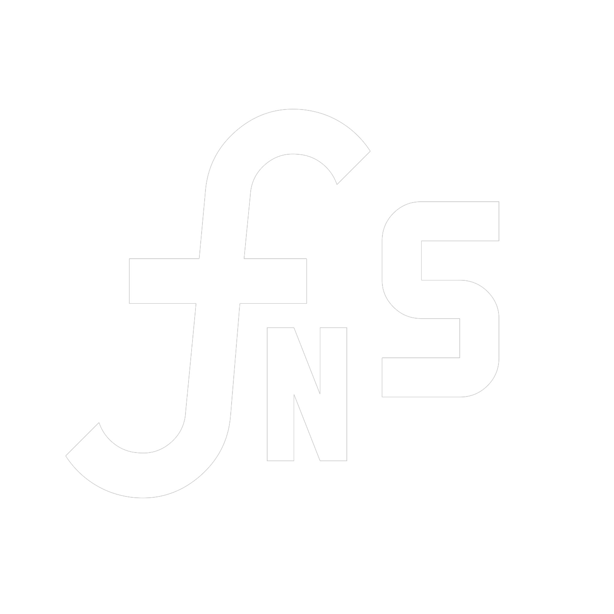

  

# FNSTools — TouchDesigner, minus the busywork

*by Daniel Molnar ([Function Store](https://functionstore.xyz))*

Templates, parameter promotion by drag and drop, MIDI and OSC mapping, network and navigation shortcuts — built to feel like they shipped with TouchDesigner. Take the whole toolkit, or pick the three tools you actually want: FNSTools v3 is a catalog of 40+ modular packages installed à la carte through an in-TouchDesigner picker, with a shared core the tools plug into.

**Website & docs: [functionstore.tools](https://functionstore.tools)** — browse every package, read a tool's page before you commit to it, or build your install in the browser.

*Watch the [InSession stream](https://www.youtube.com/watch?v=hnpC5uh-GTs) with the TouchDesigner team covering the tools in depth — recorded on an earlier release; the tools have grown since, but the ideas are the same.*

## Install

1. **Drop one `.tox`.** Drag `FNSTools.tox` into the root of a project. It arrives empty — the container you drop *is* where your tools will live.
2. **Pick your tools.** Pulse **Pick Tools** and the picker opens inside TouchDesigner. It downloads exactly the packages you tick, plus the core they need, and verifies every file against the release manifest before anything is installed.
3. **Make it the default** *(suggested)*: save the project and set it as your startup file in `Preferences → General → Startup File Mode`, so every new project opens with your tools already in it.

Requires **TouchDesigner 2025 or newer**, Windows or macOS. Full instructions and alternative install paths: [functionstore.tools](https://functionstore.tools/#get).

## Updates

Each package carries its own version, and the built-in updater compares it against the published release. Update the tools you use, leave the rest alone — your settings are preserved across the swap via config roaming.

## Where your settings live

Preferences do not live in the project file: they go into one aggregated JSON in your user palette, so the way you set a tool up follows you into the next project and survives updates. Settings roam machine-globally by default; the `Configscope` parameter can pin a project to `.toe`-only storage. MIDI and OSC maps are the deliberate exception — they save into the project folder, so they travel with the show.

## On macOS

Everything works except the Olib Browser and clipboard image paste. Where the docs say `Alt`, press `Cmd` — exceptions are called out per tool. `Alt`-right-click (or `Alt`-middle-click) any toolbar icon opens that tool's page on the website (`Option` on macOS).

## Community

Please report any [issues](https://github.com/function-store/FunctionStore_tools/issues) here on GitHub, or use the **Troubleshoot** channel on the [Discord](https://discord.gg/b4CaCP3g3K) — that's where bugs get sorted fastest.

A lot of the tools are made by [Function Store](https://functionstore.xyz), with notable contributions from [AlphaMoonbase.berlin](https://alphamoonbase.de/), [DotSimulate](https://www.patreon.com/c/dotsimulate), [Alex Guevara](https://alex-guevara.com), [Yea Chen](https://www.instagram.com/yeataro) and [Greg Hermanovic](https://derivative.ca) — please support them <3

While these tools are here for all the community to enjoy, [Patreon](https://patreon.com/function_store) follows are appreciated!

## Acknowledgements

Huge thanks to the contributors:

- [AlphaMoonbase.berlin](https://alphamoonbase.de/) for `Olib Browser`, `op_store`, `midiMapper`, `oscMapper` and lots of best practices I've learned from his components.
- [Yea Chen](https://www.instagram.com/yeataro) for the ever useful TD_SearchPalette.
- [Greg Hermanovic](https://derivative.ca) for the IO filters for the OP Create dialog, and **TouchDesigner**.
- [Dotsimulate](https://www.patreon.com/dotsimulate) for Clipboard Image Paste, and OP Create Dialog OpType Acronyms mod.
- [Alex Guevara](https://alex-guevara.com) for QuickMarks.
- [Acrylicode](https://acrylicode.com/) and [kim0slice](https://www.instagram.com/kim0slice) for the early feedback and testing.

## Notable Mentions

Some links of mostly free tools/resources:

- [Olib](https://td-olib.org/) by Wieland Hilker (Alphamoonbase.berlin): the de-facto free TD .tox marketplace
- [TD-Launcher](https://github.com/EnviralDesign/TD-Launcher/) by Lucas Morgan: if you're using multiple TD version installs this is a must have

# License

Copyright 2024 Daniel Molnar / Function Store

Permission is hereby granted, free of charge, to any person obtaining a copy of this software and associated documentation files (the “Software”), to deal in the Software without restriction, including without limitation the rights to use, copy, modify, merge, publish, distribute, sublicense, and/or sell copies of the Software, and to permit persons to whom the Software is furnished to do so, subject to the following conditions:

The above copyright notice and this permission notice shall be included in all copies or substantial portions of the Software.

THE SOFTWARE IS PROVIDED “AS IS”, WITHOUT WARRANTY OF ANY KIND, EXPRESS OR IMPLIED, INCLUDING BUT NOT LIMITED TO THE WARRANTIES OF MERCHANTABILITY, FITNESS FOR A PARTICULAR PURPOSE AND NONINFRINGEMENT. IN NO EVENT SHALL THE AUTHORS OR COPYRIGHT HOLDERS BE LIABLE FOR ANY CLAIM, DAMAGES OR OTHER LIABILITY, WHETHER IN AN ACTION OF CONTRACT, TORT OR OTHERWISE, ARISING FROM, OUT OF OR IN CONNECTION WITH THE SOFTWARE OR THE USE OR OTHER DEALINGS IN THE SOFTWARE.
