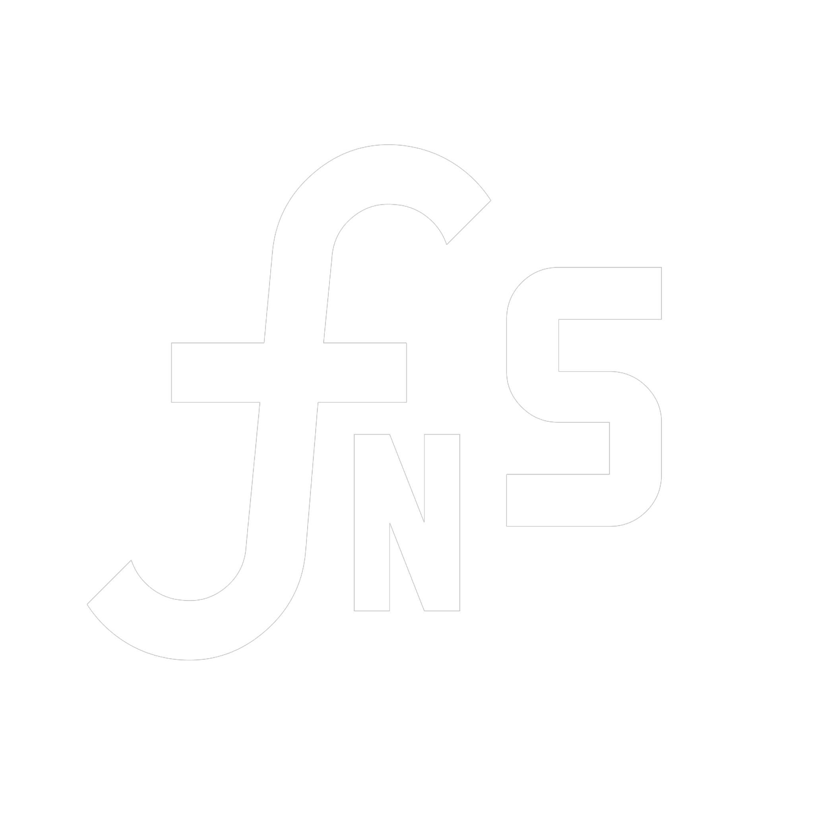

  

# FNSTools - Enhance your TouchDesigner workflow

*by Dan Molnar ([Function Store](https://functionstore.xyz))*

Templates, parameter promotion by drag and drop, MIDI and OSC mapping, network and navigation shortcuts, built to feel like they shipped with TouchDesigner. FNSTools v3 is a catalog of 80+ packages you install one by one through a picker inside TouchDesigner, on a shared core the tools plug into. Take the whole toolkit, or only the tools you want.

Most tools are free and MIT licensed, and their source is in this repository. Some unlock with a [Patreon](https://functionstore.tools/patreon/) membership; the picker installs those for members, and they are not in this repository.

**Website and docs: [functionstore.tools](https://functionstore.tools).** Browse every package, read a tool's page before you install it, or pick your tools in the browser.

*Watch the [InSession stream](https://www.youtube.com/watch?v=hnpC5uh-GTs) with the TouchDesigner team, which covers the tools in depth. It was recorded on an earlier release; the tools have grown since, but the ideas are the same.*

## Some of the tools

A few of the free ones, to give you the idea:

- **[CommandPalette](https://functionstore.tools/docs/fns-commandpalette/)**: every command your tools declare, plus TouchDesigner's own palette components, in one ranked list on a hotkey.
- **[SearchFix](https://functionstore.tools/docs/fns-searchfix/)**: the network editor's find bar finds any part of a name, in any case, with wildcards, optionally fuzzy and inside child networks.
- **[SearchPalette](https://functionstore.tools/docs/fns-searchpalette/)**: a search field for the palette browser.
- **[CustomParTools](https://functionstore.tools/docs/fns-custompartools/)**: promote parameters to a parent by drag and drop, with binds or expressions, plus extension creation and parent shortcuts.
- **[OpTemplates](https://functionstore.tools/docs/fns-optemplates/)**: a library of preconfigured operators to drop into a network.
- **[OpMenuMods](https://functionstore.tools/docs/fns-opmenumods/)**: extras for the OP Create dialog: IO filters, your own search keywords, and acronym search (type `m f o` for Movie File Out).
- **[SwapOps](https://functionstore.tools/docs/fns-swapops/)**: swap one operator for another and keep its connections.
- **[QuickCollapse](https://functionstore.tools/docs/fns-quickcollapse/)**: collapse a selection into a component.
- **[QuickMarks](https://functionstore.tools/docs/quickmarks/)** and **[QuickPane](https://functionstore.tools/docs/fns-quickpane/)**: bookmark network locations and jump back; pane layout shortcuts.
- **[ParentHierarchy](https://functionstore.tools/docs/fns-parenthierarchy/)**: hover a parent in the pane bar's path to see its shortcuts, internal operators and custom parameters.
- **[CookBar](https://functionstore.tools/docs/cookbar/)**: each operator's cook time and GPU memory drawn above it, so the expensive parts of a network stand out.
- **[midiMapper](https://functionstore.tools/docs/midimapper/)** and **[oscMapper](https://functionstore.tools/docs/oscmapper/)**: map MIDI and OSC to parameters, with a learn mode.
- **[HotkeyManager](https://functionstore.tools/docs/fns-hotkeymanager/)**: every hotkey in the toolkit in one list, with conflict detection and rebinding.
- **[ColorUI](https://functionstore.tools/docs/fns-colorui/)** and **[BorderlessTD](https://functionstore.tools/docs/fns-borderlesstd/)**: operator colour palettes; a borderless TouchDesigner window.
- **[PasteFromClipboard](https://functionstore.tools/docs/pastefromclipboard/)**: paste the image on your clipboard straight into a network (Windows).

That is a small part of it. There is much more, from GPU particle systems and colour generators to parameter randomizers, autosave and a VS Code bridge: **[browse the full catalog on functionstore.tools](https://functionstore.tools/#tools)**.

## Install

1. **Drop one `.tox`.** Drag `FNSTools.tox` into the root of a project. It arrives empty: the container you drop *is* where your tools will live.
2. **Pick your tools.** Pulse **Pick Tools** and the picker opens inside TouchDesigner. It downloads exactly the packages you tick, plus the core they need, and verifies every file against the release manifest before anything is installed.
3. **Make it the default** *(suggested)*: save the project and set it as your startup file in `Preferences → General → Startup File Mode`, so every new project opens with your tools already in it.

Coming from the 2023 toolkit (v2)? Read [Moving from v2](https://functionstore.tools/docs/guides/moving-from-v2/) first: the two cannot share a project, and the v2 updater does not offer v3.

Requires **TouchDesigner 2025 or newer**, Windows or macOS. Full instructions and alternative install paths: [functionstore.tools](https://functionstore.tools/#get).

## Updates

Each package carries its own version, and the built-in updater compares it against the published release. Update the tools you use and leave the rest alone. Your settings are kept across the swap through config roaming.

## Where your settings live

Preferences do not live in the project file: they go into one aggregated JSON in your user palette, so the way you set a tool up follows you into the next project and survives updates. Settings roam machine-globally by default; the `Configscope` parameter can pin a project to `.toe`-only storage. MIDI and OSC maps are the deliberate exception: they save into the project folder, so they travel with the show.

## On macOS

Everything works except clipboard image paste, which is Windows only. Modifier keys can differ on macOS; where they do, the tool's page says so. `Alt`-right-click (or `Alt`-middle-click) any toolbar icon opens that tool's page on the website (`Option` on macOS).

## Community

Please report any [issues](https://github.com/function-store/FunctionStore_tools/issues) here on GitHub, or use the **Troubleshoot** channel on the [Discord](https://discord.gg/b4CaCP3g3K). That's where bugs get sorted fastest.

A lot of the tools are made by [Function Store](https://functionstore.xyz), with notable contributions from [AlphaMoonbase.berlin](https://alphamoonbase.de/), [DotSimulate](https://www.patreon.com/c/dotsimulate), [Alex Guevara](https://alex-guevara.com), [Yea Chen](https://www.instagram.com/yeataro), [Lake Heckaman](https://www.patreon.com/cw/water__shed), [Anton Heestand](https://heestand.xyz) and [Greg Hermanovic](https://derivative.ca). Please support them <3

While these tools are here for all the community to enjoy, [Patreon](https://patreon.com/function_store) follows are appreciated!

## Acknowledgements

Huge thanks to the contributors:

- [AlphaMoonbase.berlin](https://alphamoonbase.de/) for `Olib Browser`, `op_store`, `midiMapper`, `oscMapper` and lots of best practices I've learned from his components.
- [Yea Chen](https://www.instagram.com/yeataro) for [TD-SearchPalette](https://github.com/yeataro/TD-SearchPalette), which SearchPalette is based on.
- [Greg Hermanovic](https://derivative.ca) for the IO filters for the OP Create dialog, and **TouchDesigner**.
- [DotSimulate](https://www.patreon.com/dotsimulate) and [Lake Heckaman](https://www.patreon.com/cw/water__shed) for Clipboard Image Paste.
- [DotSimulate](https://www.patreon.com/dotsimulate) for the OP Create Dialog OpType Acronyms mod.
- [Alex Guevara](https://alex-guevara.com) for QuickMarks.
- [Anton Heestand](https://heestand.xyz) for [Cook Bar](https://github.com/heestand-xyz/cook_bar), which CookBar is.
- [Acrylicode](https://acrylicode.com/) and [kim0slice](https://www.instagram.com/kim0slice) for the early feedback and testing.

## Notable Mentions

Some links of mostly free tools/resources:

- [Olib](https://td-olib.org/) by Wieland Hilker (Alphamoonbase.berlin): the de-facto free TD .tox marketplace
- [TDX Launcher Ultra](https://launcher.functionstore.xyz): a free desktop launcher for Windows and macOS that opens each project in the TouchDesigner build it needs, with a quick-launch palette that runs your FNSTools commands. It grew out of Lucas Morgan's [TD-Launcher](https://github.com/EnviralDesign/TD-Launcher/).

# License

Copyright (c) 2023-2026 Daniel Molnar / Function Store

Third-party code and its licenses are listed in [THIRD_PARTY_NOTICES.md](THIRD_PARTY_NOTICES.md).

Permission is hereby granted, free of charge, to any person obtaining a copy of this software and associated documentation files (the “Software”), to deal in the Software without restriction, including without limitation the rights to use, copy, modify, merge, publish, distribute, sublicense, and/or sell copies of the Software, and to permit persons to whom the Software is furnished to do so, subject to the following conditions:

The above copyright notice and this permission notice shall be included in all copies or substantial portions of the Software.

THE SOFTWARE IS PROVIDED “AS IS”, WITHOUT WARRANTY OF ANY KIND, EXPRESS OR IMPLIED, INCLUDING BUT NOT LIMITED TO THE WARRANTIES OF MERCHANTABILITY, FITNESS FOR A PARTICULAR PURPOSE AND NONINFRINGEMENT. IN NO EVENT SHALL THE AUTHORS OR COPYRIGHT HOLDERS BE LIABLE FOR ANY CLAIM, DAMAGES OR OTHER LIABILITY, WHETHER IN AN ACTION OF CONTRACT, TORT OR OTHERWISE, ARISING FROM, OUT OF OR IN CONNECTION WITH THE SOFTWARE OR THE USE OR OTHER DEALINGS IN THE SOFTWARE.
